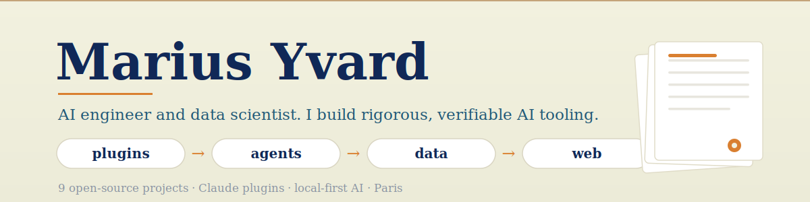

  <picture>
    <source media="(prefers-color-scheme: dark)" srcset="banner-dark.svg">
    
  </picture>

  
  
  

Engineering student at Arts et Métiers and freelance web developer. I build AI tooling that shows its work : deterministic guardrails, verified sources, reproducible scoring. Most of it runs local-first.

## Claude plugins

| Project | What it does |
| --- | --- |
| [Scriptorium](https://github.com/MariusYvard/Scriptorium) | Professional writing studio in French : 26 sourced genres, 20 deterministic guard scripts, charte-driven Word, PDF, HTML and LaTeX output. |
| [NullToHero](https://github.com/MariusYvard/NullToHero) | Build, audit and ship websites : design, SEO and code-quality skills, 15 parallel sub-agents, deterministic 0-100 scoring. |
| [saleasy](https://github.com/MariusYvard/saleasy) | Commercial cockpit in four skills : setup, marketing, prospecting, selling. |
| [dream](https://github.com/MariusYvard/dream) | Cognitive sleep cycle for Claude agents : local memory graph, nightly consolidation, multi-agent debate. |

## AI systems

| Project | What it does |
| --- | --- |
| [corparius](https://github.com/MariusYvard/corparius) | Self-hosted framework for autonomous AI micro-companies : 10-agent deterministic orchestrator, safety firewall, human-in-the-loop. |
| [axiomarius](https://github.com/MariusYvard/axiomarius) | Local OSINT enrichment for Excel CRMs, LLM runs on Ollama. |
| [vantarius](https://github.com/MariusYvard/vantarius) | LinkedIn outreach engine with local message generation and safety guards. |

## Developer tools

| Project | What it does |
| --- | --- |
| [matlab-free-vscode](https://github.com/MariusYvard/matlab-free-vscode) | Full MATLAB-style environment in VS Code through GNU Octave, no MathWorks licence. |
| [brand](https://github.com/MariusYvard/brand) | One palette, one generator : the visual identity of every repo above, regenerated from a single JSON file. |

  Visual identity generated from <a href="https://github.com/MariusYvard/brand">brand</a> : edit one palette, rebrand everything.

